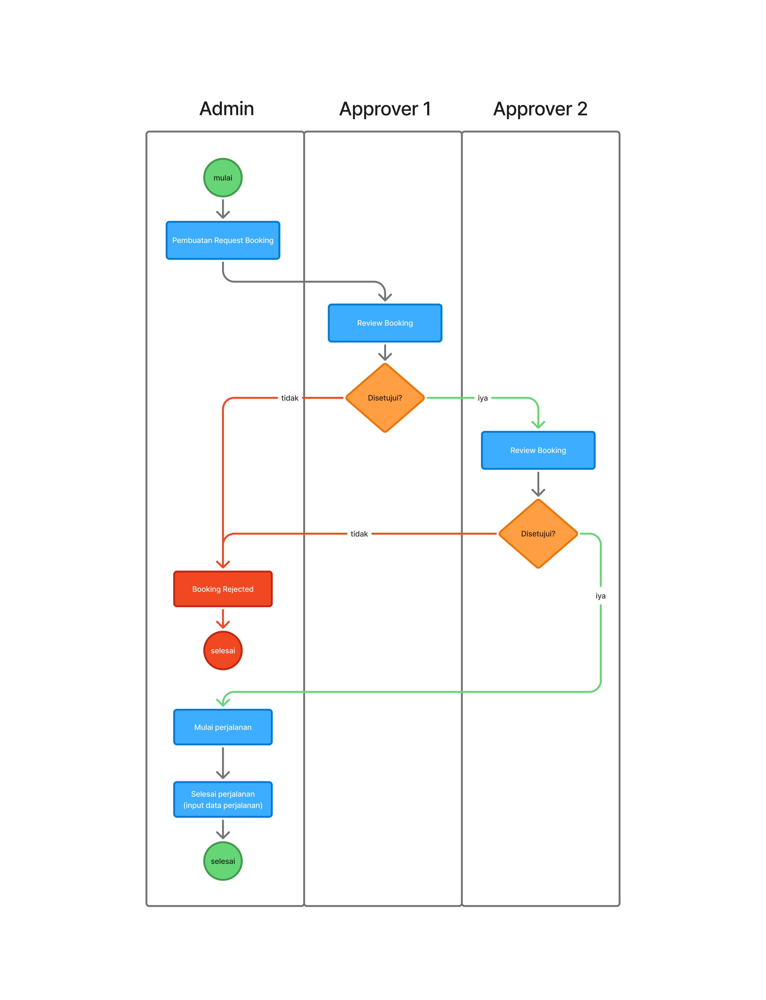
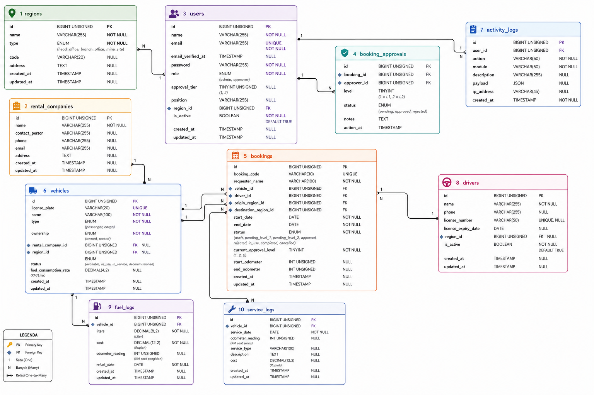

# Nickel Fleet Monitoring & Booking System
### Aplikasi Pemesanan dan Monitoring Armada Kendaraan Operasional Tambang Nikel

Aplikasi web modern untuk pemesanan, pemantauan konsumsi bahan bakar (BBM), jadwal servis, dan pelacakan riwayat pemakaian kendaraan operasional pada perusahaan tambang nikel terdistribusi (1 Kantor Pusat, 1 Kantor Cabang, dan 6 Blok Tambang Nikel).

---

## 1. Spesifikasi Teknologi & Versi Sistem

| Komponen | Teknologi | Versi |
| :--- | :--- | :--- |
| **Backend Framework** | **Laravel** | **v13.x (v13.30.1)** |
| **Backend Language** | **PHP** | **v8.2+ / v8.3** |
| **Frontend Framework** | **React.js (SPA)** | **v19.x / v18.x (Vite v8.x)** |
| **Styling & Icons** | **Tailwind CSS & Lucide Icons** | **v4.x & v1.x** |
| **Data Visualization** | **Chart.js & React-Chartjs-2** | **v4.x & v5.x** |
| **Database** | **MySQL** | **v8.0** *(Support MariaDB & SQLite)* |
| **Excel Generator** | **PhpSpreadsheet & SheetJS** | **v5.9 / v0.18** |
| **Containerization** | **Docker & Docker Compose** | **Docker Compose v5.x** |

---

## 2. Daftar Akun Pengguna & Kredensial Login (Default)

Semua akun telah dibuat otomatis melalui database seeder dengan kata sandi yang seragam:

| Peran (Role) | Nama Pengguna | Alamat Email | Kata Sandi (Password) | Hak Akses & Tugas |
| :--- | :--- | :--- | :--- | :--- |
| **Admin** | **Admin Pool Kendaraan** | `admin@tambang.com` | `password123` | Input pemesanan kendaraan, penugasan driver, pemilihan approver L1 & L2, manajemen armada, driver, input BBM, jadwal servis, analitik, export laporan Excel, dan audit log. |
| **Approver (Level 1)** | **Bambang Sutrisno, S.T.** *(Supervisor Operasional)* | `approver1@tambang.com` | `password123` | Melakukan review dan persetujuan/penolakan pemesanan tahap pertama (Level 1) disertai catatan. |
| **Approver (Level 2)** | **Ir. Hartono Gunawan, M.M.** *(Kepala Pool & GM Tambang)* | `approver2@tambang.com` | `password123` | Melakukan otorisasi persetujuan final tahap kedua (Level 2) setelah Level 1 disetujui. |
| **Approver (Level 1 Site)** | **Rahmat Hidayat, M.T.** *(Site Manager Pomalaa)* | `approver1.site@tambang.com` | `password123` | Penyetujui Level 1 untuk wilayah operasional Tambang A (Pomalaa). |

---

## 3. Cakupan Wilayah & Karakteristik Armada Tambang

### Struktur Wilayah Operasional (8 Lokasi):
1. **1 Kantor Pusat:** Jakarta (`HQ-JKT`)
2. **1 Kantor Cabang:** Kendari (`BC-KDR`)
3. **6 Blok Tambang Nikel (Mine Sites):**
   - **Tambang A (Pomalaa)** - Kolaka, Sultra
   - **Tambang B (Morowali)** - Kawasan Industri IMIP, Sulteng
   - **Tambang C (Konawe)** - Kawasan Industri Morosi, Sultra
   - **Tambang D (Kolaka)** - Blok Kolaka Utara, Sultra
   - **Tambang E (Halmahera)** - Teluk Weda, Malut
   - **Tambang F (Sorowako)** - Blok Matano, Sulsel

### Klasifikasi Armada Kendaraan (16 Unit Data Awal):
- **Berdasarkan Jenis Angkutan:**
  - **Angkutan Orang:** SUV 4x4 (Fortuner, Pajero Sport, Prado), Double Cabin 4x4 (Hilux, Triton, D-Max, Ranger), Minibus (HiAce Premio).
  - **Angkutan Barang:** Dump Truck Tambang 6x4 (Fuso Fighter, Hino 500, Scania P360, Axor, Quester) & Heavy Cargo Flatbed (Isuzu Giga).
- **Berdasarkan Status Kepemilikan:**
  - **Milik Perusahaan (*Owned*):** Aset kendaraan milik operasional tambang.
  - **Sewa (*Rented*):** Kendaraan sewa dari vendor (*PT Rental Mandiri Trans* & *PT Trans Tambang Nusantara*).

---

## 4. Panduan Menjalankan Aplikasi

Tersedia 2 cara untuk menjalankan aplikasi:

### Opsi A: Menggunakan Docker Compose (Direkomendasikan - 1 Command)

1. Pastikan Docker dan Docker Compose telah terpasang dan berjalan.
2. Jalankan perintah:
   ```bash
   docker compose up -d --build
   ```
3. Lakukan inisialisasi migrasi dan seeder database (sekali di awal):
   ```bash
   docker compose exec app php artisan migrate:fresh --seed
   ```
4. Buka browser pada:
   - **Aplikasi Web:** [http://localhost:8080](http://localhost:8080)
   - **REST API Server:** [http://localhost:8080/api](http://localhost:8080/api)

---

### Opsi B: Menjalankan Secara Standalone (Lokal PHP & Node)

#### 1. Backend (Laravel 13.x):
```bash
cd backend
composer install
cp .env.example .env
php artisan key:generate
php artisan migrate:fresh --seed
php artisan serve --port=8000
```

#### 2. Frontend (React.js SPA):
```bash
cd frontend
npm install
npm run dev
```
Akses aplikasi melalui URL Vite: [http://localhost:5173](http://localhost:5173) (otomatis terhubung via proxy ke backend port 8000).

---

## 5. Diagram Alur Proses — Activity Diagram (Swimlane Workflow)

Diagram alur swimlane mencakup interaksi dan tanggung jawab antara 3 aktor utama dalam siklus pemesanan kendaraan operasional tambang: **Admin Pool Kendaraan**, **Approver Level 1 (Supervisor)**, dan **Approver Level 2 (Kepala Pool / General Manager)**:

<p align="center">
  
</p>

### Penjelasan Tahapan Alur:
1. **Pembuatan Request Booking (Admin Pool):** Admin memasukkan formulir pemesanan, memilih kendaraan dan driver, serta menunjuk Approver L1 & L2 (Status awal: `pending_level_1`).
2. **Review & Keputusan Level 1 (Approver 1):** Supervisor memeriksa kelayakan. Jika ditolak, status beralih menjadi `rejected`. Jika disetujui, diteruskan ke Level 2 (Status: `pending_level_2`).
3. **Review & Keputusan Level 2 (Approver 2):** Kepala Pool/GM memberikan persetujuan final. Jika ditolak, status beralih ke `rejected`. Jika disetujui, pemesanan resmi disahkan (Status: `approved`).
4. **Mulai Perjalanan (Admin Pool):** Admin mencatat odometer awal saat armada diberangkatkan (Status: `in_use`).
5. **Selesai Perjalanan (Admin Pool):** Admin mencatat odometer akhir saat kepulangan. Total jarak tempuh (KM) dihitung otomatis dan status kendaraan kembali tersedia (Status: `completed`).

---

## 6. Skema Basis Data — Entity Relationship Diagram (ERD)

Arsitektur basis data relasional ternormalisasi (**MySQL 8.0**) yang menghubungkan 10 entitas tabel dengan integritas referensial (*Foreign Key Constraints*), audit trail menyeluruh, dan optimasi indeks:

<p align="center">
  
</p>

### Ringkasan 10 Tabel Basis Data:
1. **`users`**: Data autentikasi akun, peran (*admin* / *approver*), *approval tier* (1 / 2), dan penempatan kantor/tambang.
2. **`regions`**: 8 lokasi operasional (1 Kantor Pusat Jakarta, 1 Kantor Cabang Kendari, 6 Blok Tambang Nikel).
3. **`rental_companies`**: Vendor penyedia kendaraan sewa operasional tambang.
4. **`vehicles`**: Inventaris armada angkutan orang & barang, status kepemilikan (milik sendiri vs sewa), konsumsi BBM, dan status unit.
5. **`drivers`**: Master data supir operasional, nomor SIM, masa berlaku lisensi, dan status ketersediaan.
6. **`bookings`**: Transaksi utama pemesanan kendaraan, rute asal/tujuan, rentang tanggal dinas, status alur, serta odometer awal/akhir.
7. **`booking_approvals`**: Rekam jejak audit persetujuan bertingkat (Level 1 & Level 2), catatan approver, dan waktu eksekusi.
8. **`fuel_logs`**: Catatan riwayat pengisian BBM (volume liter, biaya rupiah, dan odometer saat pengisian).
9. **`service_logs`**: Catatan riwayat servis rutin & perbaikan kendaraan, jenis layanan, dan biaya bengkel.
10. **`activity_logs`**: Jejak audit sistem (*audit trail*) yang merekam seluruh aksi pengguna, modul, IP address, dan payload snapshot.

---

## 7. Fitur Utama & Modul Operasional

### A. Dashboard Monitoring & Visualisasi Grafik
Dashboard menyajikan 3 grafik visual dinamis berbasis **Chart.js**:
1. **Frekuensi Pemakaian Kendaraan (Bar Chart):** Memantau tren jumlah perjalanan dinas per bulan dalam 6 bulan terakhir.
2. **Komposisi Armada Tambang (Doughnut Chart):** Membandingkan proporsi angkutan orang vs barang serta status milik sendiri vs sewa.
3. **Tren Konsumsi BBM & Biaya (Line Chart):** Memantau volume liter konsumsi bahan bakar dan biaya operasional bulanan.
4. **Summary KPI Cards:** Menampilkan jumlah persetujuan pending, unit kendaraan aktif jalan, unit tersedia, dan total BBM bulan ini.

### B. Laporan Periodik & Export Microsoft Excel (.xlsx)
1. Buka menu **Laporan & Export Excel**.
2. Tentukan parameter filter:
   - Rentang Tanggal Mulai s/d Selesai
   - Lokasi Wilayah / Blok Tambang
   - Status Pemesanan
   - Tipe Kendaraan (Orang / Barang)
   - Status Kepemilikan (Milik / Sewa)
3. Pratinjau data tampil secara interaktif dilengkapi kalkulasi total liter BBM dan total biaya.
4. Klik tombol hijau **"Export ke Excel (.xlsx)"** untuk mengunduh laporan spreadsheet berformat resmi dengan header berstempel tanggal dan formula kalkulasi otomatis.

### C. Log Aktivitas Aplikasi (Audit Trail)
Setiap tindakan pengguna dicatat secara otomatis pada tabel log:
- Pembuatan pemesanan baru
- Persetujuan Level 1 & Level 2 / Penolakan
- Penugasan driver & status perjalanan
- Pencatatan konsumsi BBM dan jadwal servis
- Login dan logout pengguna
- Dilengkapi pencarian, filter modul, alamat IP, waktu kejadian, dan viewer **Payload JSON**.

---

## 8. Struktur Direktori Project

```
sekawan-media-test/
├── backend/                  # Laravel 13.x REST API Core
│   ├── app/
│   │   ├── Http/Controllers/Api/   # API Controllers (Auth, Booking, Approval, Fleet, Report, dll)
│   │   ├── Models/                 # Eloquent Models (10 Tabel)
│   │   └── Services/               # ActivityLogger & Business Services
│   ├── database/
│   │   ├── migrations/             # 10 Skema Migrasi Database
│   │   └── seeders/                # DatabaseSeeder komprehensif
│   └── routes/api.php              # 41 Endpoints REST API
│
├── frontend/                 # React.js 19 SPA (Vite + Tailwind CSS)
│   ├── src/
│   │   ├── components/       # Layout (Sidebar, Navbar), Common (Modals, Badges, Charts)
│   │   ├── context/          # AuthContext & ToastContext
│   │   ├── pages/            # Dashboard, Bookings, Approvals, Vehicles, Drivers, BBM, Servis, Reports, Logs
│   │   └── services/         # Axios API Client & Interceptors
│   └── vite.config.js
│
├── docker/                   # Konfigurasi Container Nginx & PHP 8.2 Alpine
│   ├── nginx/default.conf
│   └── php/Dockerfile
├── docker-compose.yml        # Orchestrator Multi-Container (App, DB, Web)
├── activity-diagram.png      # Gambar Visual Activity Diagram Swimlane
├── erd.png                   # Gambar Visual Entity Relationship Diagram (ERD)
└── README.md                 # Dokumentasi Utama Sistem
```
