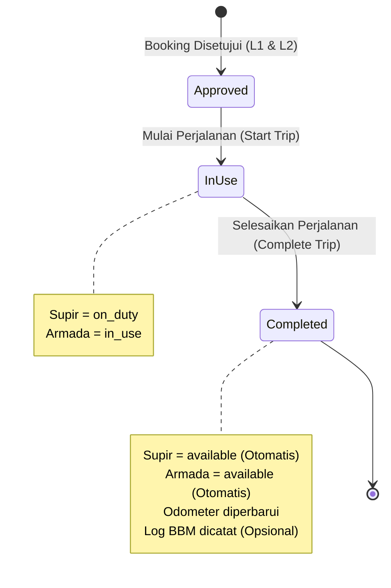

> **Dibuat:** 2026-09-03 · **Diperbarui:** 2026-09-03 · **Status:** aktif

# Monitoring Personil Bertugas & Operasional Armada (*Live Active Duties*)

Dokumentasi modul monitoring operasional terpusat untuk melacak personil supir dan karyawan yang sedang bertugas di lapangan, armada tambang yang sedang bergerak antar-site, kesiapan supir standby di setiap pool, serta pembaruan status dinamis terintegrasi log BBM.

---

## 1. Latar Belakang & Tujuan

Sebelum modul ini dibuat, koordinator armada harus memeriksa halaman pemesanan dan jadwal approval secara terpisah untuk mengetahui supir mana yang sedang berada di luar pool. Modul **Personil Bertugas (`/duties`)** menyajikan visibilitas operasional *real-time* multi-pool secara instan.

### Manfaat Utama:
- **Pelacakan Live:** Mengetahui siapa saja supir dan pemohon yang sedang aktif bertugas beserta nomor plat dan rute.
- **Kontak Cepat:** Tombol satu-klik untuk mengirim pesan WhatsApp atau panggilan suara langsung ke nomor supir.
- **Otomasi Ketersediaan Pool:** Saat perjalanan dinas diselesaikan (*Complete Trip*), status supir dan kendaraan **otomatis kembali menjadi `available` (Tersedia di Pool)**.
- **Pencatatan BBM Terintegrasi:** Opsi mencatat struk/pengisian BBM langsung saat kendaraan tiba di pool tanpa perlu beralih ke menu Log BBM terpisah.

---

## 2. Struktur Data & Tab Tampilan

| Tab Navigasi | Cakupan Data | Fitur & Aksi |
| :--- | :--- | :--- |
| **Sedang Bertugas** (`in_use`) | Penugasan aktif yang sedang berjalan di jalan/site. | Profil supir, kontak WA/Telp, info armada, rute, odometer awal, tombol *Selesaikan Trip & Catat BBM*. |
| **Terjadwal (Siap Jalan)** (`approved`) | Booking yang telah disetujui penuh oleh Approver L1 & L2. | Review rute & armada, tombol *Mulai Perjalanan (Start Trip)*. |
| **Supir Standby di Pool** (`available`) | Supir yang tidak sedang bertugas di setiap kantor cabang/site. | Kesiapan personil per wilayah penempatan, tombol kontak WA & Telepon. |
| **Selesai Hari Ini** (`completed`) | Riwayat pemakaian armada yang kembali ke pool pada hari berjalan. | Rekap jarak tempuh ($KM_{akhir} - KM_{awal}$) dan data konsumsi BBM yang tercatat. |

---

## 3. Alur Siklus Hidup Penugasan & Ketersediaan

---

## 4. Integrasi Pengisian BBM Otomatis (*Integrated Fuel Log*)

Saat koordinator menyelesaikan perjalanan di modal *Complete Trip*:
1. Jika opsi `[✓] Catat Pengisian BBM Selama Perjalanan Ini` diaktifkan:
2. Sistem mewajibkan input:
   - **Volume Liter:** Jumlah BBM yang diisi (mis. `45.5 L`).
   - **Harga per Liter:** Tarif per liter (mis. `Rp 16.500`).
   - **Estimasi Total Biaya:** Dihitung otomatis secara *real-time* ($Liter \times Tarif$).
   - **Nomor Struk / Nota SPBU:** Bukti pembayaran kas operasional.
3. Backend Laravel secara atomik membuat entri baru pada tabel `fuel_logs` terhubung ke `booking_id` dan `vehicle_id`.
4. Data ini seketika muncul pada modul [Monitoring Konsumsi BBM](fuel-logs.md) dan memperbarui grafik tren biaya bahan bakar pada [Dashboard Utama](arsitektur-aplikasi.md).

---

## Terkait:
- Dokumen Rencana: [`plans/monitoring-personil-bertugas-dan-armada.md`](../plans/monitoring-personil-bertugas-dan-armada.md)
- Controller Backend: [`backend/app/Http/Controllers/Api/DutyController.php`](../backend/app/Http/Controllers/Api/DutyController.php)
- Controller Booking: [`backend/app/Http/Controllers/Api/BookingController.php`](../backend/app/Http/Controllers/Api/BookingController.php)
- Halaman Frontend: [`frontend/src/pages/Duties.jsx`](../frontend/src/pages/Duties.jsx)
- Navigasi Sidebar: [`frontend/src/components/app-sidebar.jsx`](../frontend/src/components/app-sidebar.jsx)
- Wiki Dashboard Cabang: [`docs/dashboard-kantor-cabang.md`](./dashboard-kantor-cabang.md)
- Wiki Panduan Penggunaan: [`docs/panduan-penggunaan.md`](./panduan-penggunaan.md)
